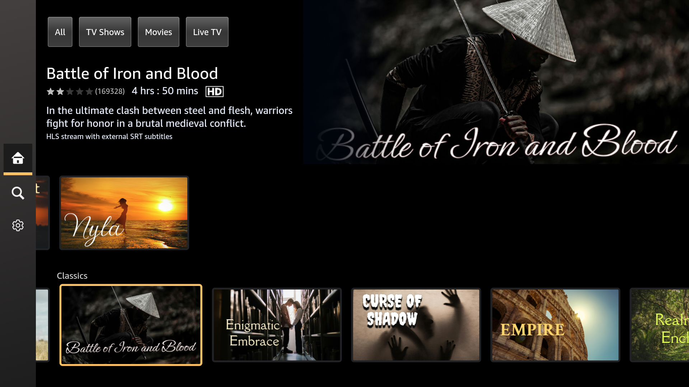

# vvd-screen

Live screen stream for the **Amazon Vega Virtual Device (VVD)**, served on
`localhost`. It captures the device screen through the Android-emulator
**gRPC `streamScreenshot`** API (push-based, at the device's real frame rate),
JPEG-encodes each frame, and serves it as an MJPEG stream you can open in any
browser.

Measured **~78 fps** at 1920×1080 during on-device UI animation (a 24 fps movie
streams at 24 fps — the stream always matches whatever the device renders).
3W50P7
```
  ▶  Vega Virtual Device screen stream is live:
      http://127.0.0.1:8080/
```



## Quick start

```bash
cargo run --release
```

Then open the printed URL (default <http://127.0.0.1:8080/>). That's it.

On startup the tool will:

1. Attach to a VVD that already exposes gRPC, **or**
2. Make sure a VVD is running (`vega virtual-device start`), read the exact
   emulator command it used, stop it, and **relaunch the same instance with
   gRPC enabled** (`-grpc 8554 -grpc-use-token`). The relaunched VVD keeps
   running after you quit this tool.

## Requirements

- The **Vega SDK** (`vega` on `PATH`) with a TV virtual device installed.
- **Rust** (stable) and **`protoc`** (`brew install protobuf`) — `protoc` is
  needed at build time to compile the emulator proto.
- macOS / Apple Silicon (developed and tested there).

## Options

```
--http <ADDR>        HTTP listen address           (default 127.0.0.1:8080)
--grpc-port <PORT>   emulator gRPC port            (default 8554)
--width <PX>         requested capture width, 0=native device width
--display <ID>       display id to capture         (default 0)
--quality <1..=100>  JPEG quality                  (default 80)
--no-autostart       only attach to an existing gRPC VVD; never (re)launch
```

Env vars `VVD_HTTP_ADDR`, `VVD_GRPC_PORT` are also honored. Set `RUST_LOG=debug`
for verbose logs.

## Endpoints

| Path         | Description                                            |
|--------------|--------------------------------------------------------|
| `/`          | Viewer page (live `` + fps/resolution overlay)    |
| `/stream`    | MJPEG (`multipart/x-mixed-replace`) — the live stream  |
| `/frame.jpg` | The latest single frame as JPEG                        |
| `/healthz`   | JSON: connected, frames, width, height, frame age      |

## How it works

```
emulator gRPC  ──streamScreenshot(RGB888)──▶  tonic client
   :8554                                          │ JPEG encode (per frame)
                                                  ▼
browser  ◀──MJPEG / multipart──  axum HTTP server (:8080)
```

`streamScreenshot` is push-based: the emulator emits a frame whenever it renders
a new one, so the stream runs at the device frame rate (up to 60+ fps during
animation/video) and goes quiet when the screen is static — no polling, no
wasted work.

## Why it launches the VVD the way it does (hard-won notes)

The Vega VVD is the Android emulator (`vega-virtual-device`, build 34.1.15)
behind a custom launcher. Enabling its gRPC control API on macOS has three
non-obvious requirements, all handled automatically by `src/vvd.rs`:

1. **Launch through the `agent/emulator` *launcher*, not the engine binary.**
   The `vega` CLI never passes `-grpc`, so we relaunch ourselves — but running
   the `vega-virtual-device` engine directly crashes (missing dylib env, and an
   unrealized Qt window faults on the first input event). The launcher performs
   the macOS app/window + `DYLD_LIBRARY_PATH` setup that keeps it stable, so we
   reuse the instance's exact args and add `-grpc 8554 -grpc-use-token`.
2. **`-grpc-use-token` is mandatory.** A tokenless gRPC call hits the access
   allowlist's reject path and **crashes** the emulator. Every RPC must carry
   `authorization: Bearer <grpc.token>`; the token is read from the emulator
   discovery file (`~/Library/Caches/TemporaryItems/avd/running/pid_*.ini`).
3. **Never call `getStatus`.** On this build it reads `hardwareConfig` →
   queries the (non-robust) GL context for GPU strings and **crashes** the
   emulator. `streamScreenshot` and `getVmState` are safe; this tool only uses
   `streamScreenshot`.

## License

MIT (see [LICENSE](LICENSE)).

`proto/emulator_controller.proto` is vendored from the Android Open Source
Project (Apache-2.0) and retains its original license header; it ships with the
Vega/Android emulator SDK.
